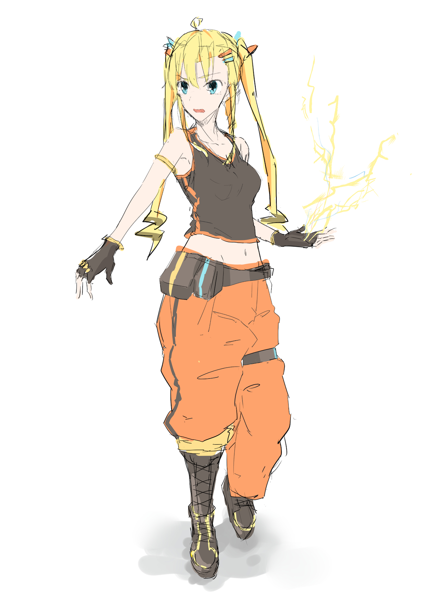

# 電撃少女エクレア
電撃を操る少女が、工場をベースにしたステージを攻略していくゲーム

## 10/31までの目標
* 敵がいる
* ボスがいる
* ステージがある
* Loading時間にイライラさせない仕組みがある
* グラフィックの追い込みとデバッグ以外は済んでいる！！！！！！！

## 役職
* プランナー：なおてぃ
* ディレクター：なおてぃ
* アートディレクター：仮名
* キャラクターデザイナー：仮名
* サウンドディレクター:わらび
* バックグラウンドデザイナー：みっつー
* UI,UXデザイナー：わらび
* 3Dグラフィックスデザイナー:つつみん
			みっつー
* メインプログラマー：なおてぃ
* テクニカルアドバイザー：わらび
* アートアドバイザー：みっつー
* ガンスミス: みっつー

## キャラ

### エクレア

* エクレア・オ・ショコラ
* 電気を使いこなすなんかクールな女子
* 6頭身
* ボルトを投げる(ボルトの大きさは頭くらい)

## 操作方法
(操作: キーボード,ゲームパッド)

移動:	WASD,左スティック  
ロックオン:	Shift??,ZR(検討の余地あり)  
ボルト投げ:	右クリック,R  
SBT:	左クリック,L  
エトワール:	Space,ZL  
カメラリセット: ホイールクリック,右スティック押し込み

## ロードマップ
* 8/6 しゃぶしゃぶ決起！
なおてぃ宅は神
さきいかはうまい、なぜならさきいかだから
* 10/14 αリリース
* 10/31 βリリース
* 11/10 完成！

なおてぃのテスト文章

## ボルトが通れてエクレアがエトワールで通れない壁の作り方

1. ヒエラルキーからCubeオブジェクトを作る
2. オブジェクトのトランスフォームを変更して作りたい壁の大きさに合わせる
3. オブジェクトのタグとレイヤーを「EclairKeepOut」に変更する
4. メッシュレンダラーのチェックを外す

これで作れます。  
（エトワールで通ろうとしたときの挙動：ボルトにエトワールでぶつかった時の雷のエフェクトが現れず、そのままエクレア人間体になる）

